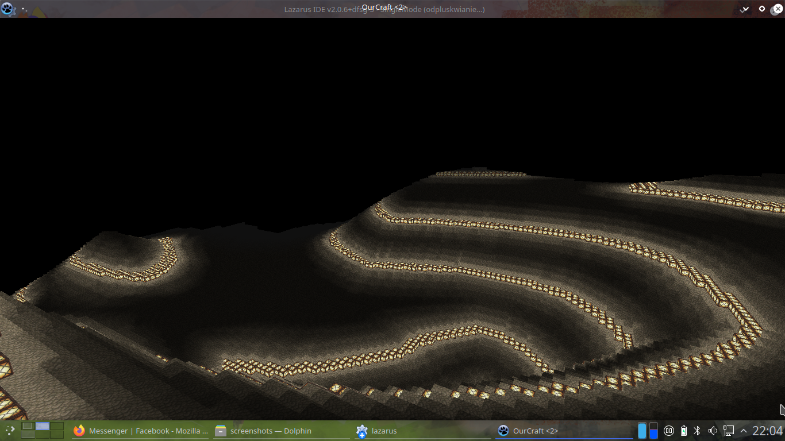
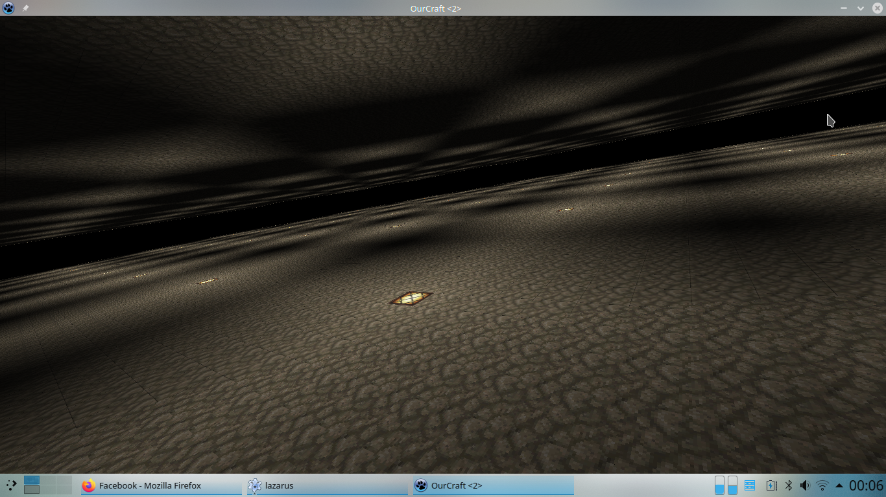

# Ourcraft 

Better, bigger and more communist than Minecraft; Predicted official release: 08-2021

# Main differences between Ourcraft and Minecraft

Warning: this is project, some (almost all) of this features haven't been implemented yet.

1. [+] There is no height limit
2. [-] Levels instead of other worlds (as Nether or End)
3. [-] More 3D GUI (during the gameplay)
4. [+] It is not executed by Java Virtual Machine (JVM), but it is executable file, so there is more FPS
     
It's not playable yet. But you can: 

* Fly: WASD, Space (Up) and X (Down)
* Move camera: IJKL 
* Edit blocks: N and M (but only in constant, determined distance)

Changelog:

* Saving and loading blocks (chunks)
* Still buf fixes
* Added Perlin Noise algorithm for any count of dimenstion
* Added simply terrain generator
* Bug fixes and optimalization

How to compile and run

1. Install required packages: "installation/apt install_requires". It may be necessary to change version of some libs, so then edit the file.
2. Execute "run.sh"
3. An executable file should be in "bin/SingleMode" (other files do nothing for gameplay)

or execute "make all" to install and compile and then execute "make run" to open game in single mode.

In case of errors with the compilation, open with the Lazarus "source/Single-mode/SingleMode.lpr" and then click Package -> Open loaded package.
Find "lazopenglcontext", open it and compile. Then click Run -> Build.
And then, you can type "make run" (in the console, in main directiry of project) to open the game in single mode.

Screenshots:

